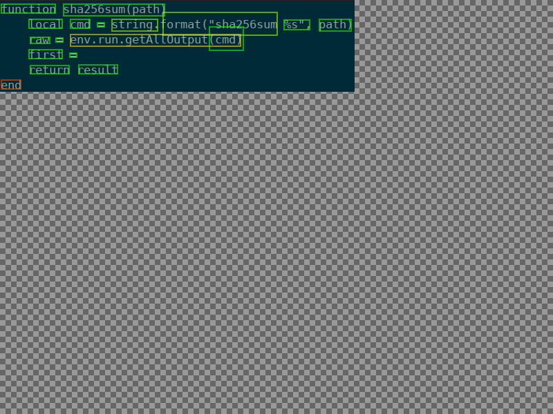

# UnnamedOCRVisualizerPort

A WIP experiment in making a small, portable OCR output visualizer.

|  |  |
| :------------------------------------------------------: | :---------------------------------------------------------------------------: |
| Tesseract's `eurotext.png`                               | A `sha256sum` wrapper                                                         |


## Requirements

So far:

1. [Love2D][] >= 12.0
   - This is a prerelease version
   - See [build info](#building-love2d-12)
2. [Tesseract][] for OCR

[Tesseract]: https://github.com/tesseract-ocr/tesseract

### Optional Accessories

You can load arbitrary images if you have ImageMagick's `magick` command installed.

On Mac, homebrew should work. On Linux, your package manager should handle installing.
For windows or more details, please see the [ImageMagick download page][].

[ImageMagick download page]: https://imagemagick.org/script/download.php


## Why?

1. Lua-based applications:
   - are easier to ship
   - start and run faster than Python-based[^1] ones
1. Refresh myself on Lua
2. See how [Love2D][] has progressed

[Love2D]: https://love2d.org/

## What's Supported?

Goals include:

- [X] Word-level [Tesseract][]-style [TSV][] output
  - [X] Minimal color mapping
  - [X] System filepicker to choose files
- [ ] Character-level Tesseract mapping from the word-level (WIP)
- [ ] Minimal UI:
  -[ ] Mouse-based gestures
  -[ ] Hot keys

XML-based [ALTO][] *may* also happen, but it's not a
priority given this is a port of an existing tool.


[Tesseract]: https://github.com/tesseract-ocr/tesseract
[TSV]: https://en.wikipedia.org/wiki/Tab-separated_values
[ALTO]: https://en.wikipedia.org/wiki/Analyzed_Layout_and_Text_Object

## How do I use `run.sh`?

**TL;DR:** Install [Love2D][] + [Tesseract][] before `./run.sh`

> [!IMPORTANT]
> VS Code can cause Love2D to launch with no window decorations! See [VS Code Workaround](#vs-code-workaround) for a fix.

### Build Love2D 12.0's Pre-Release

Love2D's upcoming 12.0 release offers performance and API improvements even as an unfinished work in progress.

This means you currently have to build it from source to use this project. On Debian, you can use `sudo ./get_deps.sh` to get known build dependencies.

On other operating systems or Linux distros, you may need to consult the following:
* The [Love2D dependencies list][]
* The relevant documentation for your package manager
* The [Love2D compilation instructions][]

On sufficiently Debian-like Linux, `sudo ./get_deps.sh force` **may** work. However, it's best to double check.

[Love2D dependencies list]: https://github.com/love2d/love?tab=readme-ov-file#dependencies
[Love2D compilation instructions]: https://github.com/love2d/love?tab=readme-ov-file#compilation

### Add your Love2D v12.0 to `$PATH`

Once you've compiled, find the `build/` folder in the cloned Love2D repo. Then do one of the following to add the new Love2D 12.0 to your `PATH` as `love12.0`

- copy the file to install it
- link it into a `~/bin` folder
- alias it in your `.bashrc`

> [!NOTE]
> You can also skip `./run.sh` and use your own build/runner script.

### Building the `.love` file

The `./run.sh` script auto-packages a `.love` file from
the source folder.

```shell
$ ./run.sh
```
All arguments after are passed through directly.

### VS Code Workaround

On some Linux systems running Wayland, VS Code can cause Love2D to launch with no Window decorations.

Console output will include the following:
```
libdecor-gtk-WARNING: Failed to initialize GTK
Failed to load plugin 'libdecor-gtk.so': failed to init
No plugins found, falling back on no decorations
```

As a workaround, you can launch VS Code with the following flags:
```shell
code --enable-features=UseOzonePlatform --ozone-platform=wayland
```

### Future Considerations

You'll want to use the [AppImage][] for Love2D 12.0 once it releases, especially on Debian.

This will ensure you avoid creating a [FrankenDebian].


[FrankenDebian]: https://wiki.debian.org/DontBreakDebian#Don.27t_make_a_FrankenDebian
[AppImage]: https://appimage.org/
[cloning the repo]: https://docs.github.com/en/repositories/creating-and-managing-repositories/cloning-a-repository

[^1]: Both CPython and Pillow can be fairly slow.
